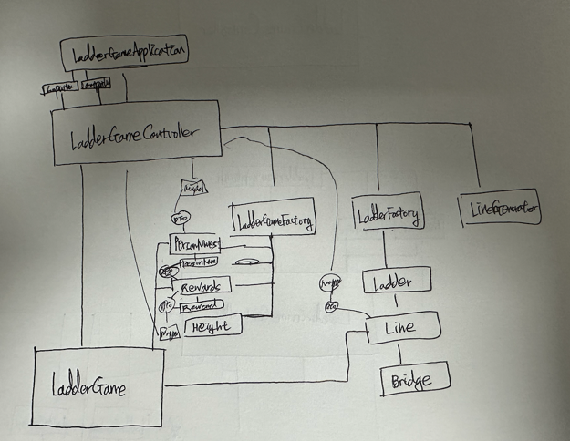

# 기능 요구 사항
1. 사다리 게임에 참여할 인원을 입력받는다.
2. 사다리 최대 높이를 입력받는다.
3. 사다리를 생성한다.
4. 사다리를 출력한다.

---
# 기능 분석
1. 사다리 게임을 참여할 인원을 입력받는다.
   1. 입력된 값을 검증한다.
   2. 쉼표(,)로 구분된 인원을 분리한다.

2. 사다리 최대 높이를 입력받는다.
   1. 숫자인지 검증한다.
   2. 숫자로 변환한다.

3. 사다리를 생성한다.
   1. 최대 높이에 해당 하는 사다리를 생성한다.

4. 사다리를 출력한다.

# 첫 번쨰 구조
              LadderGameController(사다리 게임 제어)
                          /      \
                  PersonName(사람)  Lines(사다리 일급컬렉션)
                                    |
                                 Line(사다리 실행한다)

# 고민
1. 객체 생성
   Person/Name 둘중 뭐를 만들 것인가?
   1. Person,Name 이 구조를 가져가면 자동차 경주에서 처럼 깊은 의존성이 생길 것 같다.
   2. Name이 구조만 가져가면 의존성의 깊이가 생기는 것은 피할 수 있으나 의미가 헷갈리지 않을까?
   3. 카 - 카이름 / 사다리-사람이름 => 동일한 관계는 아닌 것 같아서 고민된다. 의존성 깊은 것은 피하고싶은데 어떻게 할 수 있을까
      지금은 의존성 깊은 것을 피하고 싶고, 의미의 모호성을 피하기 위해서 PersonName을 사용하게 되었다.

2. getter를 지양하라
   3. 정적 팩터리 메서드를 사용하면 게터를 지양할 수 있을 것 같은데,

3. 클린코드
   1. 상수 위치
      1. PersonName에 상수가 들어가는데 상수를 가장 위에 올리는게 맞나?

--- 1차 피드백 이후
1. 로직 분리
   2. Line[해결]
      1. 다리 생성 로직을 어떻게 더 이쁘게 만들 수 있을까?
         1. 검사 - 생성 방식 [메서드 분리로 해결]
         2. 생성 - 검증 -> 재생성 or 반환 [적용 X]
            - 근데 validateBridge이런 메서드가 Line책임인가라고 생각했을때 아닌 것 같다.
            - validateLine은 어떤가? 이러면 Line책임이 맞는 것 같긴한데...
         3. Bridge라는 enum 타입을 만든다면 이를 어떻게 활용할 수 있을까?
         4. Line이 Bridges(Bridge 일급 컬렉션)을 가지는 건 어떨까?
            - 의존성이 좀 깊어지는 것 같다.
               - Lines - Line - Bridges - Bridge ? Line과 Bridges가 뭐가 다른가? 쓸떼없이 의존성을 늘리는 느낌이다.
                  - Line : List<Bridge> bridges;
                  - Bridges : List<Bridge> bridges;
         5. LineGenerator가 라인 생성 책임을 가져간다. [적용 O]
            1. LineGenerator가 Line생성에 대한 책임을 가져가고, Line은 생성할 떄 검증을, LineGenerator는 생성하는 역할을 한다. Line과 LineGenerator의 의존성을 분리했다.
            2. LineGenerator의 이름만보면 Line을 반환해야하는데, Line 객체의 필드값으로 있으니 어떻게 저장하지 고민하다 외부로부터 생성해야겠다는 생각이 들었다.

2. DTO
   1. View만의 로직 분리
      2. View만의 로직을 설계하기 위해선 DTO가 필요하다 생각되었다.
         1. DTO로 변환하는 로직은 누가 가지고 있어야하는가?
            2. Lines와 Line에 변환하는 로직을 작성했다. DTO에 의존성이 생긴건 거부감이 없는가?
               1. 도메인이 DTO를 알고있는 것은 좋지않다. 왜냐하면 둘의 생명주기가 다르다. 도메인은 비즈니스에 종속되어있고, DTO는 뷰에 종속되어있기에 둘의 생명주기가 다르기에 분리하는게 둘의 의존성을 끊어내는 것이 맞다고 생각한다.
                  1. [Mapper 도입] 도메인안에 toDto메서드가 있던 상태에서 Mapper를 사용해서 의존성을 끊어냈다.
                     1. LineMapper가 Line까지 알고있고, Line의 메서드를 호출하는 상태 이거 괜찮은가?
                        1. [모르겠음]
                     2. PersonNameMapper가 PersonName의 메서드를 호출하는 이 상태 괜찮은가?
                        1. [모르겠음 == 위의 내용과 동일]
   2. getter 지양
      1. DTO를 쓰려고 모델에 toDto라는 메서드를 사용하게되면서 도메인 단에서 getter메서드의 사용이 없어지고 있다는 느낌을 받았다.
      2. 도메인단에서 사용하지 않았지만 뷰단에서 결국 getter를 값을 가져와 출력하고 있는데 이는 괜찮은가?
         1. [애매하다] 뷰는 DTO로부터 getter를 사용하는 것이므로 괜찮다?
   3. DTO를 감싼 DTO는 어떤지?
      1. PersonNameDtos - ArrayList<PersonNameDto>
         1. DTO가 반환될거라고 생각했는데 List<DTO>가 반환되면 좀 이상하다고 생각할 수 있을 것 같긴하다.  
            계속 감싸면 너무 깊이 만들어질수도 있을것 같다. 깊이 만들어지면 안되나? 공부해야겠다.
            1. [애매하다] DTO안에 DTO를 쓰면 어떻게 될까?
               - 컬렉션이 코드로 드러나지 않는다 -> 코드는 깔끔해지겠지만 가독성이 올라가나? 이거 장점인가?
               - 클래스가 많아진다 -> 단점
               - 지금으로선 장점은 애매하고 단점은 확실하니 안쓰는 쪽으로 해야할 것 같다.  
                 DTO안에 DTO상태를 외부 DTO안 내부 DTO가 존재한다고 표현해보자.
                 현재는 외부DTO에 컬렉션형태의 내부DTO만 들어가기때문에 사용하지 않는 쪽이 좋다고 생각한다.
                 만약 추가적인 정보가 포함되어야한다면 고려해볼 것 같다.
   4. DTO는 언제써야할까?
      1. DTO를 쓰기로 마음먹었다면 List<String>으로 넘어왔던 것들도 List<DTO>로 모두 변환해야하나? 공부해야겠다.
         1. [애매하다] 모두 변환해야 일관성있는 코드로 생각하고 뷰에서 찍어낼떄 좋지 않을까?

3. 객체분리
   1. Height
      1. Height는 VO다. 이 값을 Height 필드인 height 값을 컨트롤러에 노출시키지 않고 어떻게 Lines에 넘겨줌으로써 Lines들을 생성할 수 있을까?
         1. Height 객체를 생성자 파라미터로 넣는다?
            1. Lines와 Height의 의존성이 생기는건 괜찮은가?
               1. [해결] 2안으로 해결해서 Lines는 Height에 대해 전혀 모른다.
      2. 메서드를 추가하여 의존성이 생기지 않도록 해결함
         1. Height 객체의 높이를 확인하면서 canInstall과 install 메서드를 추가하여 모두 다 설치되었는지 확인하도록 처리해서 의존성 문제를 끊어냈다.

--- 2차 피드백 이후

1. DTO
   1. 왜 쓸까?
      1. DTO(Data Transfer Object)는 비즈니스로직을 포함하지 않는 순수하게 데이터를 전달하기 위해 만들어진 객체입니다.  
         클라이언트와 서버간의 데이터를 주고받기 위해서 사용됩니다. 서버내에서는 비즈니스로직을 담고있는 도메인 객체를 통해서 데이터를 주고받습니다.
         DTO를 사용하면 다음과 같은 이점이 있습니다.  
         1. 노출될 데이터만을 분리해 제공할 수 있다.
         2. API 호출 횟수를 감소시킬 수 있다.
         3. 스프링에서는 데이터의 검증로직이나 API문서화를 위한 코드들과 분리할 수 있다.
            1. 데이터 검증 로직은 API별로 다를 수 있기에 이런 경우 DTO를 사용하지 않는다면 표현할 수 없습니다.
      2. DTO 단점은 없을까?
         1. 클래스 수가 많아진다  
            존재하기에 데이터가 채워져 무조건 반환되는 필드 값들에 대해선 공통 DTO를 만들 것을 추천하고 있습니다.
   2. Mapper는 MVC중 누구꺼일까?
      1. Mapper는 DTO를 만들어주는 작업을 하는 객체인데, 원래 이 작업은 컨트롤러에서 뷰나 클라이언트에 제공하기 전에 작업해야한다고 생각합니다.
         컨트롤러가 원래 데이터변환, 흐름제어 책임을 가지고 있었습니다. Mapper가 추가되면서 데이터 변환에 대한 컨트롤러의 책임을 분리했다고 생각합니다.

2. 의존성
   1. 람다와 익명클래스 공부해보기
      1. 람다식
         1. 함수형 인터페이스의 구현체를 익명클래스보다 간결하게 표현하기 위해 나온 문법이다.
      2. 함수형 인터페이스
         1. 프로그래밍 패러다임은 명령형 프로그래밍과 선언형 프로그래밍 방식으로 나뉘는데, 선언형 프로그래밍 방식 중 함수형 프로그래밍이라는 것이 존재한다.
            함수형 프로그래밍은 무엇을 할 건지 선언하는 형태를 의미한다. 자바는 명령형 프로그래밍이면서 객체지향적인 특성을 가지고 있다.
            자바에서 람다식과 함수형 인터페이스를 사용하면 함수형 프로그래밍을 할 수 있다.
            자바에서는 함수형 인터페이스로써 하나의 메서드만 정의한 인터페이스들이 존재한다.
            Consumer, Supplier, Function, Operator, Predicate, Runnable가 존재하고 매개변수와 반환 타입의 종류에 따라 구분된다.
         이처럼 함수형 프로그래밍을 하게되면, 가독성이 향상되고 코드의 길이가 짧아진다는 장점이 있다.
         하지만 너무 남용하게된다면 오히려 가독성을 헤칠 수 있다고 한다.
   2. 컨트롤러 의존성 줄이기

3. getter/setter
   1. getter 지양하라는 의미는 뭘까?
      1. getter를 남용하게된다면 단순 조회하는 것으로 끝나지 않고 조회한 값에 대한 작업이 발생해서 책임의 분산이 일어날 수 있기 떄문에 지양하라는 것으로 이해했습니다.
         1. 그러면 getXXX메서드를 완전히 사용하지말라는걸까?
            1. DTO에서와 같이 데이터를 단순 조회용도로 사용하는 것이라면 getXXX메서드를 사용해도 된다고 이해했습니다.
               1. DTO에서 값을 사용하기 위한 get은 사용해도 된다면 도메인 -> DTO로 담기 위한 get메서드도 사용해도 될까?
                  1. 사용해도됩니다. 다만 적절한 자료구조를 고민하고 불변 객체를 보장하기 위해 불변 컬렉션을 사용하고, 원본과의 고리를 끊어내야 합니다.
         2. 책임 분산이 일어날 수 있다는 것은 무슨말인가?
            1. 책임 분산이라는 의미는 변경에 의한 변경전파가 일어나기 쉬운 구조를 의미한다.
            2. getter를 단순 조회용이 아니라 다른 로직에 포함되어 사용될 경우,  
               getter를 제공하던 객체가 변경된다면 다른 객체들에게도 변경이 전파된다.  
               애초부터 이 객체에게 어떤 메시지를 던져서 실행하고 있었다면 변경에 영향을 받지 않게된다.  
               객체는 받은 메세지에 대한 제대로 반응만 하면되고, 이로부터 책임을 명확히 할 수 있다.  
      2. getter이전에 public 필드의 문제점[getter를 쓰게된 근본적인 이유]
         1. 캡슐화의 부족
            2. public 필드를 사용하게되면 캡슐화와 모듈화가 깨져 유지보수성이 악화된다는 문제가 있다.  
               public 필드를 사용하면 캡슐화가 깨지는데 이로부터 객체와 사용자간의 결합력이 발생한다. 구현을 바꿀때마다 사용자에게 영향을 주게 된다.
               내부 구현의 자료구조를 바꿧으면 사용자는 자료구조에 맞는 메서드로 변경을 해줘야 사용할 수 있어진다. 이렇게 바꿔야하는 메서드들이 엄청나게 많다면 당연히 유지보수를 악화시킨다.
         2. 도메인 규칙 무시
            1. 도메인 규칙을 무시하게 된다. 기존의 메서드별로 도메인 규칙을 적용해야하고, 새로 생겨날 메서드들에 대해서도 하나하나 모두 적용해줘야 한다.
               이는 관리해야할 코드가 늘어난다는 것을 의미하고, 유지보수성을 악화시킨다.
      [결론]
         1. 비즈니스로직 코드를 작성하는 과정에서 getter의 사용하지말아야한다.
         2. 조회용으로 사용할 경우에는 자료구조를 고민하고 완벽하게 불변임을 보장하라.

   2. setter는 왜 지양해야할까?
      1. 공개 set 메서드는 변경되는 맥락에 대해서 설명하지 않는다.
      2. 도메인 규칙을 도메인으로부터 분리시켜 유지보수성이 떨어지는 코드를 만든다.
         1. 메서드를 만들 때마다 비즈니스로직에 도메인 규칙과 관련된 코드들이 포함된다.
      3. 송신자에게 메시지를 보낼 때 메서드를 보고 수신자의 행동을 예측할 수 있는데, 공개 set메서드는 이에 대한 예측을 불가능하게 만든다.

4. 테스트
   1. 테스트 커버리지가 너무 낮다.  
      100% 만큼의 커버리지는 아니어도 비즈니스로직에 대한 검증을 하면서 커버리지를 대략 80퍼까지 올렸습니다.

--- 3차 피드백
1. 객체 의존도 그려볼 것
   1. 의존도가 너무 복잡한 것 같으니 그려보기를..
      
2. 컨벤션
   1. (다음미션부터) 필드 두개 이상 갖지 말 것

3. 필드 네이밍
   1. LadderGame의 필드 중 map이 cached라는 이름을 가지는게 맞을까? 
      1. 필드를 가지고 있는 상태에 대해서 cached라는 단어를 쓰는것이 조금 어색하긴 하다는 것인데..  
         어떤 네이밍 센스를 적용해야할까 고민하다가 일단 cached라는 단어만 빼기로했다.

4. 책임
   1. inputView
      1. (,)에 대한 검증은 inputView에 대한 책임일까? / 파싱하면 안될까?
         1. 실무에서는 프론트엔드와 협업을 하기 떄문에 실무를 기준으로 생각해보면 뷰에 대한 검증과 파싱은 프론트엔드에게 책임을 위임할 수 있다고 생각합니다.

5. 방어적 복사
   1. getter를 통해 값을 반환할 떄 방어적 복사에 대해서 신경쓰자.
      1. getter로 반환할 떄 불변객체를 보장해야한다는 사실에 대해선 알고 있습니다.

6. 의존성 주입
   1. LineGenerator는 라인을 만드는 객체만 알면 되지 않을까? LadderGameController가 알아야할까?
      1. 컨트롤러부터 주입해줄 이유는 없는 것 같습니다. 언제부터 주입할 지에 대해 고민을 했는데, 객체가 알아야하는 시점부터 넣어주면 되겠다고 생각합니다.
      2. LineGenerator -> BridgeGenerator로 이름을 변경하고, Line이 BridgeGenerator를 주입받도록 수정하였습니다.

7. 테스트
   1. 테스트는 어디까지 생각하고 짜야할까?
      1. 라이브러리에 대한 검증은 하지 않아도 된다고 생각합니다.

8. 람다식 / 함수형 인터페이스
   1. BooleanSupplier 적용 / 기존 BooleanGenerator 인터페이스 삭제
      1. util에 BooleanGenerator 인터페이스와 RandomBooleanGenerator를 삭제하고 자바에서 제공하는 BooleanSupplier를 제공하여 값을 입력받았습니다.
      2. 테스트 코드에서도 함수형 인터페이스 주입하는 방식을 람다식을 이용해 익명클래스를 간단하게 만드는 방법을 채택했습니다.